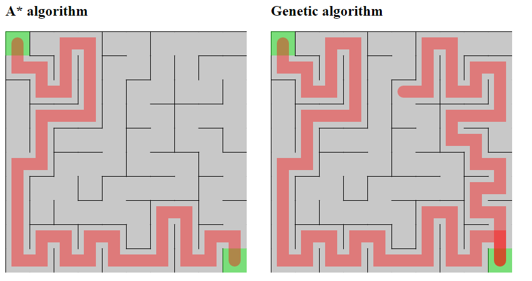

# Sprawozdanie

## Wstęp

Niniejszy projekt polegał na przeprowadzeniu badań pod kątem efektywności *algorytmu genetycznego* w odnajdowaniu drogi w labiryncie (czyli przejściu łamigłówki) w stosunku do algorytmu *A**.

Badania zostały przeprowadzone z wykorzystaniem tylko i wyłącznie języka JavaScript oraz przeglądarki jako narzędzia do wizualizacji wyników. Implementacja wszystkich wykorzystanych w programie algorytmów jest pracą własną (również budowanie labiryntu - algorytm *recursive backtracker*) z wykorzystaniem bibliotek *Genetic.js* do wykonywania algorytmu genetycznego oraz *p5.js* do wizualizowania działań w przeglądarce.

## Założenia

1. Badania skupiają się na badaniu algorytmu genetycznego pod kątem jego nieprzewidywalnych działań, modyfikowaniu parametrów takich jak ilość iteracji, wielkość populacji, prawodopobieństwo mutacji oraz crossoveru między chromosomami, sposób crossoveru, a także funkcja fitness.

2. Punktem odniesienia w pomiarach jest algorytm *A**, który z założenia powinien działać efektywniej ze względu na swoje deterministyczne i przewidywalne zachowanie.

3. Labirynt zawsze posiada tylko i wyłącznie jedną poprawną drogę do końca (wynika to z natury algorytmu *recursive backtracker*).

4. Chromosomami są ciągi ruchów po labiryncie.

5. Ruchy możliwe do wykonania w labiryncie to:
  - góra
  - dół
  - lewo
  - prawo

  W związku z powyższym, do obliczania dystansu pomiędzy punktami w labiryncie wykorzystana została *metryka taksówkowa*.

## Implementacja funkcji fitness

### Naiwna

W tym wariancie, chromosom oceniany jest pod kątem dystansu od punktu, do którego najdalej można było dzięki niemu dojść, do punktu, który oznaczony jest jako koniec labiryntu.

Wartość zwracaną przez funkcję można opisać następującą konstrukcją:

`dystans(najdalszy, labirynt.koniec)`

### Single-path

Ten wariant rozwiązuje problem przypadku brzegowego, z którym z reguły nie powinien poradzić sobie wariant naiwny.

Lekarstwem było tutaj uzależnienie zwracanej wartości od przebytej drogi w labiryncie (odwiedzonych punktów) oraz sprawienie by był to parametr ważniejszy od odległości najdalszego punktu na ścieżce code do konća. W ten sposób nagradzamy algorytm za znajdywanie co raz to dłuższych ścieżek, a mała odległość od punktu docelowego jest bonusem, który ma dodatkowo naprowadzić algorytm na ścieżkę, która jest poprawna.

Wartość zwracaną przez funkcję można opisać następującą konstrukcją:

`(sciezka.dlugosc * 10) * dystans(labirynt.start, ostatni(sciezka))`

### Double-path

Ostatni zaimplementowany wariant mając na wejściu chromosom, w tym samym czasie ewaluuje jego oba końce w taki sam sposób jak w przypadku wariantu *single-path*.

O ile w *single-path* liczyliśmy odległość najdalszego punktu do końca, to tutaj nie miałoby to zastosowania. Zamiast tego bierzemy pod uwagę długość obu ścieżek oraz ich odległość od ich początku do ich końca, a pod koniec uśredniamy.

Wartość zwracaną przez funkcję można opisać następującą konstrukcją:

`((pierwsza.dlugosc * 10) * dystans(pierwszy(pierwsza), ostatni(pierwsza)) + (druga.dlugosc * 10) * dystans(ostatni(druga), pierwszy(druga))) / 2`

Gdzie `pierwsza` to ścieżka od początku labiryntu, a `druga` to scieżka od końca labiryntu.

Oprócz tego, że implementacja była tutaj dużo trudniejsza ze względu na dodatkowe warunki, które trzeba było nałożyć (np. jeżeli jedna ze ścieżek trafi na punkt odwiedzony przez drugą ścieżkę, to zwracamy obie ściezki, ponieważ z ich ewaluacji otrzymamy wynik).

Wbrew pozorom ten wariant rzadko kiedy daje lepsze rezultaty, a jest bardzo narażony na błędy. Z tego co zauważyłem to startując od końca, istnieje większe prawdopodobieństwo wpadnięcia w niepoprawną ścieżkę. Algorytm wówczaj jest nagradzany za postęp wynikający ze zwiększającej się długości nieoprawnej ścieżki i jedynym ratunkiem na tą przypadłość jest już tylko mutacja.

## Przykłady

### *Naive*
#### Przypadek brzegowy

#### Do czasu optymistyczny (schodkowanie)

#### Nienajgorszy przypadek, z którym *naive* sobie poradził

### *Single-path*
#### Bardzo prosty przypadek

### *Double-path*
#### Rozbieżność ścieżek
Tutaj zobrazowany jest przypadek kiedy pierwsza ścieżka jest poprawna, a druga zamiast wyjść jej naprzeciw, wybiera inną drogę (najprawdopodobniej dlatego, że była lepiej punktowana).

#### Porównanie *single-path* i *double-path*

#### Nagradzanie za zabliżanie się ścieżek
Aby zneutralizować nieporządane działanie algorytmu *double-path* przyznawałem dodatkowe punkty jeżeli najmłodsze elementy obu ścieżek zbliżały się do siebie. Poniżej niezbyt zadowalający efekt takiego rozwiązania.

